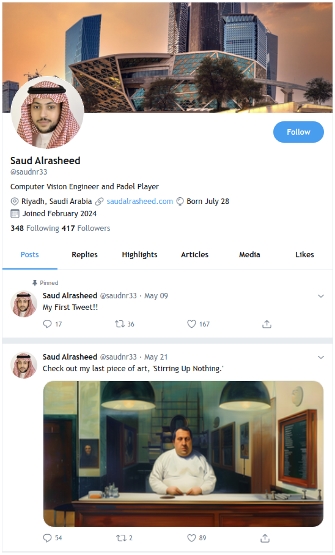

# Twitter Tweet Mockup

A simple project built using Python and Gradio to generate mockups of Twitter tweets. This tool allows you to create tweet mockups for presentations, design prototypes, or just for fun.

## Features

- **Customizable tweet content**: Input any text, username, and handle to create a personalized tweet.
- **User-friendly interface**: Built with Gradio, making it easy to customize and generate tweet mockups in real-time.
- **Mock Twitter styling**: Mimics the look and feel of an actual Twitter tweet for authentic mockups.

## Requirements

- **Python** 3.x

  

